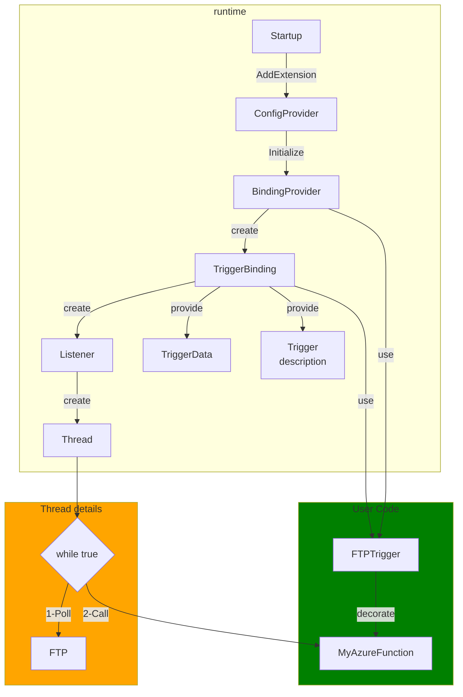

```mermaid
flowchart TB
    TB -- use -->FTPA
    subgraph usercode [User Code]
        FTPA[FTPTrigger]-- decorate -->AF[MyAzureFunction]
    end

    subgraph runtime        
        A[Startup]-- AddExtension -->CP[ConfigProvider]
        CP -- Initialize -->BP[BindingProvider]
        BP -- use --> FTPA[FTPTrigger]
        BP -- create --> TB[TriggerBinding]
        TB -- create --> L[Listener]
        TB -- provide --> TD[TriggerData]
        TB -- provide --> TBD[Trigger\ndescription]
        L -- create -->T[Thread]
    end

    subgraph threaddetails [Thread details]
        th1{while true}-->|1-Poll|FTP[FTP]
        th1 -->|2-Call|AF
    end
    T --> th1
    style threaddetails fill:orange
    style usercode fill:green
    classDef c1 fill:#f96;
```
